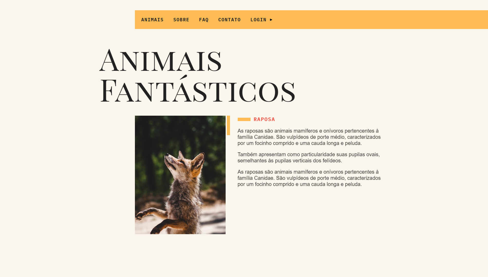
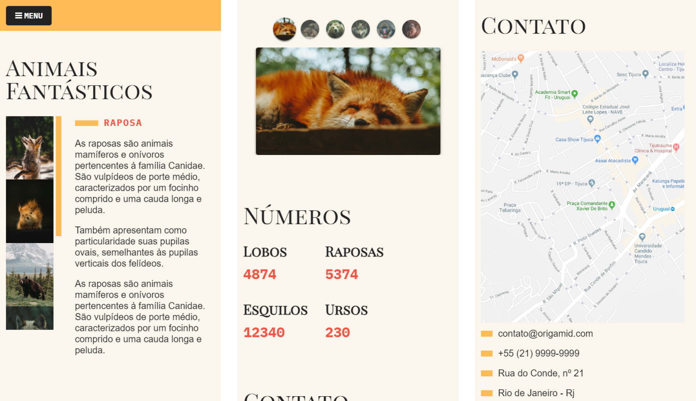

# Animais Fantásticos 🦊

Acesse o projeto clicando [aqui](https://filipehibrael.github.io/animais-fantasticos/)

## 📱 Layout Mobile

## 📖 Sobre

Um projeto no qual o foco foi principalmente o JavaScript. Possui diversas funcionalidades e possibilidades de interações com o usuário, como animações, accordion list, tooltip, carrossel de slides, integração com API, etc. Além disso, todo o layout foi construído utilizando a ferramenta de grid layout, tornando o site mais responsivo e adaptável. Projeto desenvolvido durante o curso de HTML e CSS da plataforma [Origamid](https://www.origamid.com/)

## 🛠️ Ferramentas Utilizadas

- HTML5
- CSS3
- JavaScript